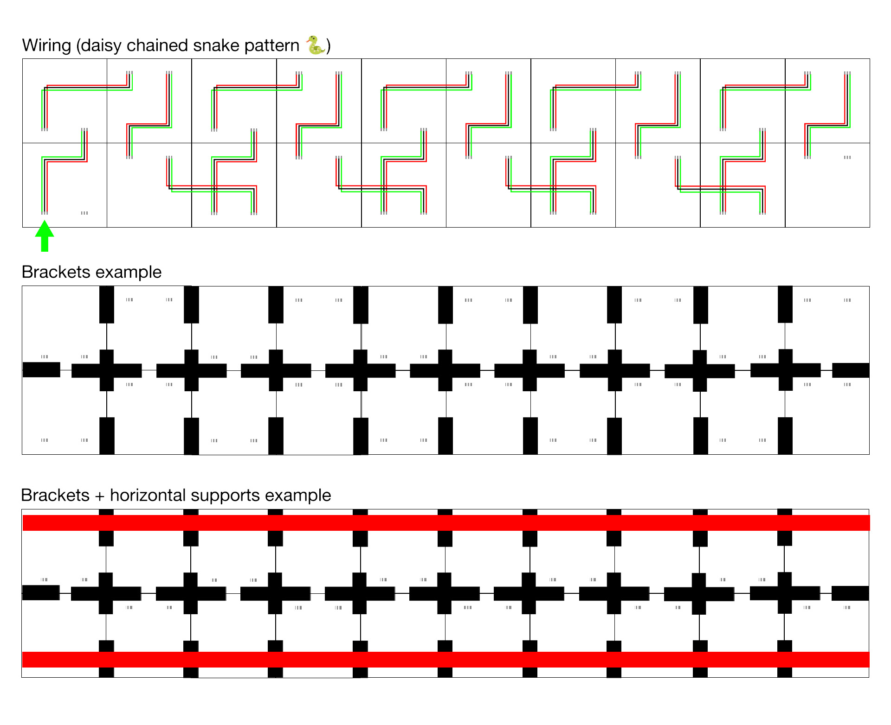
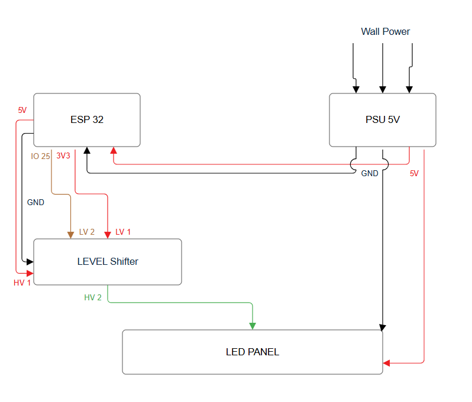

# TheFlightWall

TheFlightWall is an LED wall which shows live information of flights going by your window.

This is the open source version with some basic guides to the panels, mounting them together, data services, and code. Check out our viral build video: [https://www.instagram.com/p/DLIbAtbJxPl](https://www.instagram.com/p/DLIbAtbJxPl)

**Don't feel like building one? Check out the offical product: [theflightwall.com](https://theflightwall.com)**

*Airline logo lookup will be added soon!*

# Component List
- Main components
    - 20x [16x16 LED panels](https://www.aliexpress.us/item/2255800358269772.html)
    - ESP32 dev board (we used the [R32 D1](https://www.amazon.com/HiLetgo-ESP-32-Development-Bluetooth-Arduino/dp/B07WFZCBH8) but any ESP dev board should work)
    - 3D printed brackets (or MDF / cardboard)
    - 2x 6ft wooden trim pieces (for support)
- Power
    - [5V >20A power supply](https://www.amazon.com/dp/B07KC55TJF) (for 20 panels)
    - [3.3V - 5V voltage level shifter](https://www.amazon.com/dp/B07F7W91LC)
- Data
    - [OpenSky](https://opensky-network.org/) for ADS-B flight data
    - [FlightAware AeroAPI](https://www.flightaware.com/commercial/aeroapi/) for route, aircraft, and airline information

# Hardware

## Dimensions

With 20 panels (10x2) - ~63 inches x ~12.6 inches

## LED Panels
[These are the LED panels we used](https://www.aliexpress.us/item/2255800358269772.html), but any similar LED matrix should work.

We designed 3D printable brackets to attach the panels together, this is one approach, but you could also use MDF board or even cardboard (as we did originally haha)

Then two 63 inch horizontal supports for extra strength. We bought wooden floor trim and cut it to size.

Obviously this is just one way to hold them together, but we're sure there are better ways!

## Wiring

Here is a wiring diagram for how to connect the whole system together.

The entire panel is controlled by one data line - simple electronics in exchange for very low refresh rates, don't expect any 60 FPS gaming on this panel!

# Data and Software

## Data API Keys

The data for this project consists of two main data sources:
1. Core public [ADS-B](https://en.wikipedia.org/wiki/Automatic_Dependent_Surveillance%E2%80%93Broadcast) data for flight positions and callsigns - using [OpenSky](https://opensky-network.org)
2. Flight information lookup - aircraft, airline, and route (origin/destination airport). This is typically the hardest / most expensive information to find. Using [FlightAware AeroAPI](https://flightaware.com/aeroapi)

### Setting up OpenSky
1. Register for an [OpenSky](https://opensky-network.org/) account
2. Go to your [account page](https://opensky-network.org/my-opensky/account)
3. Create a new API client and copy the `client_id` and `client_secret` to the [APIConfiguration.h](firmware/config/APIConfiguration.h) file

### Setting up AeroAPI
1. Go to the [FlightAware AeroAPI]([https://flightaware.com/aeroapi](https://flightaware.com/aeroapi)) page and create a personal account
3. From the dashboard, open **API Keys**, click **Create API Key** and follow the steps
8. Copy the generated key and add it to [APIConfiguration.h](firmware/config/APIConfiguration.h)

## Software Setup

### Set your WiFi

Enter your WiFi credentials into `WIFI_SSID` and `WIFI_PASSWORD` in [WiFiConfiguration.h](firmware/config/WiFiConfiguration.h)

### Set your location

Set your location to track flights by updating the following values in [UserConfiguration.h](firmware/config/UserConfiguration.h):

- `CENTER_LAT`: Latitude of the center point to track (e.g., your home or city)
- `CENTER_LON`: Longitude of the center point
- `RADIUS_KM`: Search radius in kilometers for flights to include

### Build and flash with PlatformIO

The firmware can be built and uploaded to the ESP32 using [PlatformIO](https://platformio.org/)

1. **Install PlatformIO**: 
   - Install [VS Code](https://code.visualstudio.com/)
   - Add the [PlatformIO IDE extension](https://platformio.org/install/ide?install=vscode)

2. **Configure your settings**:
   - Add your API keys to [APIConfiguration.h](firmware/config/APIConfiguration.h)
   - Add your WiFi credentials to [WiFiConfiguration.h](firmware/config/WiFiConfiguration.h)
   - Set your location (and optional display preferences) in [UserConfiguration.h](firmware/config/UserConfiguration.h)
   - Adjust display hardware (pin, tile layout) in [HardwareConfiguration.h](firmware/config/HardwareConfiguration.h)

3. **Build and upload**:
   - Open the `firmware` folder in PlatformIO
   - Connect your ESP32 via USB
   - Click the "Upload" button (→) in the PlatformIO toolbar

### Customization

- **Brightness**: Controls overall display brightness (0–255)
  - Edit `DISPLAY_BRIGHTNESS` in [UserConfiguration.h](firmware/config/UserConfiguration.h)
- **Text color**: RGB values used for all text/borders
  - Edit `TEXT_COLOR_R`, `TEXT_COLOR_G`, `TEXT_COLOR_B` in [UserConfiguration.h](firmware/config/UserConfiguration.h)

We may add more customization options in the future, but of course this being open source the whole thing is customizable to your liking.

# Thanks
We really appreciate all the support on this project!

If you don't want to build one but still find it cool, check out our offical displays: **[https://theflightwall.com](https://theflightwall.com)**

Excited to see your builds :) Tag @theflightwall on IG